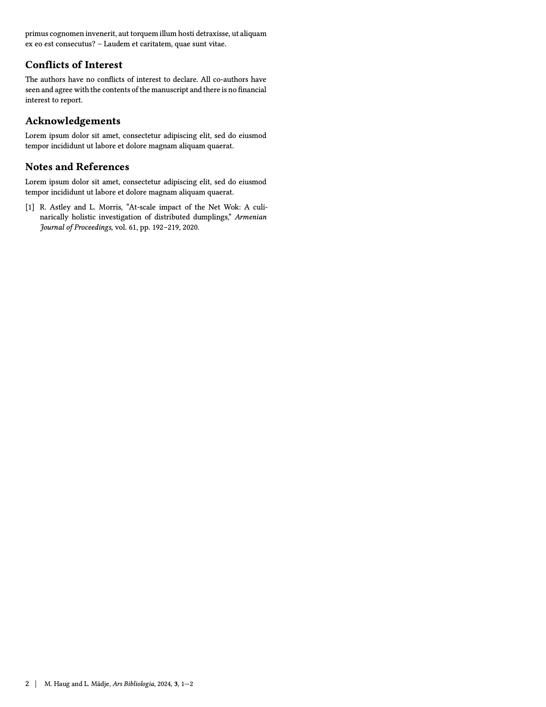

# chemicoms-paper
This is a Typst template for a two-column paper in a style similar to that of the Royal Society of Chemistry.

## Usage
You can use this template in the Typst web app by clicking "Start from template" on the dashboard and searching for the `chimicoms-paper`.

Alternatively, you can use the CLI to kick this project off using the command
```
typst init @preview/chemicoms-paper
```

## Configuration
This template exports the `template` function with the following named arguments:


The functions also accepts a single, positional argument for the body of the paper.

This template with initialize your package with a sample call to the `template` function in a show rule. If you want to change an existing project to use this template, you can add a show rule like this at the top of your file:

```typ


```

## Media

<p align="center">
  
&nbsp; &nbsp; &nbsp; &nbsp;
  
</p>